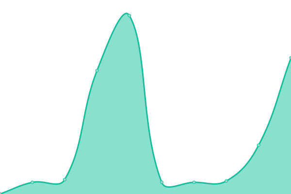
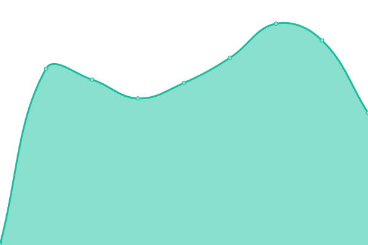

# [📈 Live Status](https://xnaas.github.io/nitter-instances): <!--live status--> **🟧 Partial outage**

This repository contains the open-source uptime monitor and status page for [xnaas](https://xnaas.info/), powered by [Upptime](https://github.com/upptime/upptime).

With [Upptime](https://upptime.js.org), you can get your own unlimited and free uptime monitor and status page, powered entirely by a GitHub repository. We use [Issues](https://github.com/xnaas/nitter-instances/issues) as incident reports, [Actions](https://github.com/xnaas/nitter-instances/actions) as uptime monitors, and [Pages](https://xnaas.github.io/nitter-instances) for the status page.

<!--start: status pages-->
<!-- This summary is generated by Upptime (https://github.com/upptime/upptime) -->
<!-- Do not edit this manually, your changes will be overwritten -->
<!-- prettier-ignore -->
| URL | Status | History | Response Time | Uptime |
| --- | ------ | ------- | ------------- | ------ |
|  [nitter.net](https://nitter.net) | 🟥 Down | [nitter-net.yml](https://github.com/xnaas/nitter-instances/commits/HEAD/history/nitter-net.yml) | 

 0ms
     
 | 

<a href="https://xnaas.github.io/nitter-instances/history/nitter-net">0.00%</a>
    

|  [nitter.42l.fr](https://nitter.42l.fr) | 🟩 Up | [nitter-42l-fr.yml](https://github.com/xnaas/nitter-instances/commits/HEAD/history/nitter-42l-fr.yml) | 

 826ms
     
 | 

<a href="https://xnaas.github.io/nitter-instances/history/nitter-42l-fr">100.00%</a>
    

|  [nitter.pussthecat.org](https://nitter.pussthecat.org) | 🟩 Up | [nitter-pussthecat-org.yml](https://github.com/xnaas/nitter-instances/commits/HEAD/history/nitter-pussthecat-org.yml) | 

 564ms
     
 | 

<a href="https://xnaas.github.io/nitter-instances/history/nitter-pussthecat-org">100.00%</a>
    

|  [nitter.nixnet.services](https://nitter.nixnet.services) | 🟩 Up | [nitter-nixnet-services.yml](https://github.com/xnaas/nitter-instances/commits/HEAD/history/nitter-nixnet-services.yml) | 

 1390ms
     
 | 

<a href="https://xnaas.github.io/nitter-instances/history/nitter-nixnet-services">100.00%</a>
    

|  [nitter.mastodont.cat](https://nitter.mastodont.cat) | 🟥 Down | [nitter-mastodont-cat.yml](https://github.com/xnaas/nitter-instances/commits/HEAD/history/nitter-mastodont-cat.yml) | 

 745ms
     
 | 

<a href="https://xnaas.github.io/nitter-instances/history/nitter-mastodont-cat">100.00%</a>
    

|  [nitter.tedomum.net](https://nitter.tedomum.net) | 🟩 Up | [nitter-tedomum-net.yml](https://github.com/xnaas/nitter-instances/commits/HEAD/history/nitter-tedomum-net.yml) | 

 1161ms
     
 | 

<a href="https://xnaas.github.io/nitter-instances/history/nitter-tedomum-net">100.00%</a>
    

|  [nitter.fdn.fr](https://nitter.fdn.fr) | 🟩 Up | [nitter-fdn-fr.yml](https://github.com/xnaas/nitter-instances/commits/HEAD/history/nitter-fdn-fr.yml) | 

 593ms
     
 | 

<a href="https://xnaas.github.io/nitter-instances/history/nitter-fdn-fr">100.00%</a>
    

|  [nitter.1d4.us](https://nitter.1d4.us) | 🟩 Up | [nitter-1d4-us.yml](https://github.com/xnaas/nitter-instances/commits/HEAD/history/nitter-1d4-us.yml) | 

 356ms
     
 | 

<a href="https://xnaas.github.io/nitter-instances/history/nitter-1d4-us">100.00%</a>
    

|  [nitter.kavin.rocks](https://nitter.kavin.rocks) | 🟩 Up | [nitter-kavin-rocks.yml](https://github.com/xnaas/nitter-instances/commits/HEAD/history/nitter-kavin-rocks.yml) | 

 1233ms
     
 | 

<a href="https://xnaas.github.io/nitter-instances/history/nitter-kavin-rocks">100.00%</a>
    

|  [tweet.lambda.dance](https://tweet.lambda.dance) | 🟩 Up | [tweet-lambda-dance.yml](https://github.com/xnaas/nitter-instances/commits/HEAD/history/tweet-lambda-dance.yml) | 

 561ms
     
 | 

<a href="https://xnaas.github.io/nitter-instances/history/tweet-lambda-dance">100.00%</a>
    

|  [nitter.cc](https://nitter.cc) | 🟩 Up | [nitter-cc.yml](https://github.com/xnaas/nitter-instances/commits/HEAD/history/nitter-cc.yml) | 

 617ms
     
 | 

<a href="https://xnaas.github.io/nitter-instances/history/nitter-cc">100.00%</a>
    

|  [nitter.vxempire.xyz](https://nitter.vxempire.xyz) | 🟩 Up | [nitter-vxempire-xyz.yml](https://github.com/xnaas/nitter-instances/commits/HEAD/history/nitter-vxempire-xyz.yml) | 

 729ms
     
 | 

<a href="https://xnaas.github.io/nitter-instances/history/nitter-vxempire-xyz">100.00%</a>
    

|  [nitter.unixfox.eu](https://nitter.unixfox.eu) | 🟩 Up | [nitter-unixfox-eu.yml](https://github.com/xnaas/nitter-instances/commits/HEAD/history/nitter-unixfox-eu.yml) | 

 1438ms
     
 | 

<a href="https://xnaas.github.io/nitter-instances/history/nitter-unixfox-eu">100.00%</a>
    

|  [nitter.domain.glass](https://nitter.domain.glass) | 🟩 Up | [nitter-domain-glass.yml](https://github.com/xnaas/nitter-instances/commits/HEAD/history/nitter-domain-glass.yml) | 

 326ms
     
 | 

<a href="https://xnaas.github.io/nitter-instances/history/nitter-domain-glass">100.00%</a>
    

|  [nitter.himiko.cloud](https://nitter.himiko.cloud) | 🟩 Up | [nitter-himiko-cloud.yml](https://github.com/xnaas/nitter-instances/commits/HEAD/history/nitter-himiko-cloud.yml) | 

 2735ms
     
 | 

<a href="https://xnaas.github.io/nitter-instances/history/nitter-himiko-cloud">100.00%</a>
    

|  [nitter.eu](https://nitter.eu) | 🟩 Up | [nitter-eu.yml](https://github.com/xnaas/nitter-instances/commits/HEAD/history/nitter-eu.yml) | 

 666ms
     
 | 

<a href="https://xnaas.github.io/nitter-instances/history/nitter-eu">100.00%</a>
    

|  [nitter.ethibox.fr](https://nitter.ethibox.fr) | 🟩 Up | [nitter-ethibox-fr.yml](https://github.com/xnaas/nitter-instances/commits/HEAD/history/nitter-ethibox-fr.yml) | 

 919ms
     
 | 

<a href="https://xnaas.github.io/nitter-instances/history/nitter-ethibox-fr">100.00%</a>
    

|  [nitter.namazso.eu](https://nitter.namazso.eu) | 🟩 Up | [nitter-namazso-eu.yml](https://github.com/xnaas/nitter-instances/commits/HEAD/history/nitter-namazso-eu.yml) | 

 505ms
     
 | 

<a href="https://xnaas.github.io/nitter-instances/history/nitter-namazso-eu">100.00%</a>
    

|  [nitter.mailstation.de](https://nitter.mailstation.de) | 🟩 Up | [nitter-mailstation-de.yml](https://github.com/xnaas/nitter-instances/commits/HEAD/history/nitter-mailstation-de.yml) | 

 868ms
     
 | 

<a href="https://xnaas.github.io/nitter-instances/history/nitter-mailstation-de">100.00%</a>
    

|  [nitter.actionsack.com](https://nitter.actionsack.com) | 🟥 Down | [nitter-actionsack-com.yml](https://github.com/xnaas/nitter-instances/commits/HEAD/history/nitter-actionsack-com.yml) | 

 501ms
     
 | 

<a href="https://xnaas.github.io/nitter-instances/history/nitter-actionsack-com">100.00%</a>
    

|  [nitter.cattube.org](https://nitter.cattube.org) | 🟩 Up | [nitter-cattube-org.yml](https://github.com/xnaas/nitter-instances/commits/HEAD/history/nitter-cattube-org.yml) | 

 715ms
     
 | 

<a href="https://xnaas.github.io/nitter-instances/history/nitter-cattube-org">100.00%</a>
    

|  [nitter.dark.fail](https://nitter.dark.fail) | 🟩 Up | [nitter-dark-fail.yml](https://github.com/xnaas/nitter-instances/commits/HEAD/history/nitter-dark-fail.yml) | 

 1047ms
     
 | 

<a href="https://xnaas.github.io/nitter-instances/history/nitter-dark-fail">100.00%</a>
    

|  [birdsite.xanny.family](https://birdsite.xanny.family) | 🟩 Up | [birdsite-xanny-family.yml](https://github.com/xnaas/nitter-instances/commits/HEAD/history/birdsite-xanny-family.yml) | 

 531ms
     
 | 

<a href="https://xnaas.github.io/nitter-instances/history/birdsite-xanny-family">100.00%</a>
    

|  [nitter.40two.app](https://nitter.40two.app) | 🟩 Up | [nitter-40two-app.yml](https://github.com/xnaas/nitter-instances/commits/HEAD/history/nitter-40two-app.yml) | 

 733ms
     
 | 

<a href="https://xnaas.github.io/nitter-instances/history/nitter-40two-app">100.00%</a>
    

|  [nitter.skrep.in](https://nitter.skrep.in) | 🟩 Up | [nitter-skrep-in.yml](https://github.com/xnaas/nitter-instances/commits/HEAD/history/nitter-skrep-in.yml) | 

 500ms
     
 | 

<a href="https://xnaas.github.io/nitter-instances/history/nitter-skrep-in">100.00%</a>
    

<!--end: status pages-->

[**Visit our status website →**](https://xnaas.github.io/nitter-instances)

## 📄 License

- Powered by: [Upptime](https://github.com/upptime/upptime)
- Code: [MIT](./LICENSE) © [xnaas](https://xnaas.info/)
- Data in the `./history` directory: [Open Database License](https://opendatacommons.org/licenses/odbl/1-0/)
