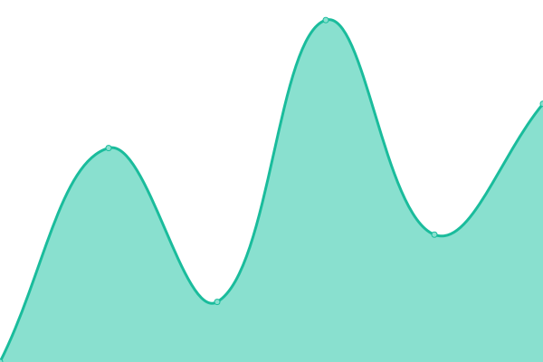

# [📈 Live Status](https://xnaas.github.io/nitter-instances): <!--live status--> **🟧 Partial outage**

This repository contains the open-source uptime monitor and status page for [xnaas](https://xnaas.info/), powered by [Upptime](https://github.com/upptime/upptime).

With [Upptime](https://upptime.js.org), you can get your own unlimited and free uptime monitor and status page, powered entirely by a GitHub repository. We use [Issues](https://github.com/xnaas/nitter-instances/issues) as incident reports, [Actions](https://github.com/xnaas/nitter-instances/actions) as uptime monitors, and [Pages](https://xnaas.github.io/nitter-instances) for the status page.

<!--start: status pages-->
<!-- This summary is generated by Upptime (https://github.com/upptime/upptime) -->
<!-- Do not edit this manually, your changes will be overwritten -->
<!-- prettier-ignore -->
| URL | Status | History | Response Time | Uptime |
| --- | ------ | ------- | ------------- | ------ |
|  [Official](https://nitter.net) | 🟥 Down | [official.yml](https://github.com/xnaas/nitter-instances/commits/HEAD/history/official.yml) | 

 0ms
     
 | 

<a href="https://xnaas.github.io/nitter-instances/history/official">100.00%</a>
    

|  [42l](https://nitter.42l.fr) | 🟩 Up | [42l.yml](https://github.com/xnaas/nitter-instances/commits/HEAD/history/42l.yml) | 

 936ms
     
 | 

<a href="https://xnaas.github.io/nitter-instances/history/42l">100.00%</a>
    

|  [PussTheCat](https://nitter.pussthecat.org) | 🟩 Up | [puss-the-cat.yml](https://github.com/xnaas/nitter-instances/commits/HEAD/history/puss-the-cat.yml) | 

 802ms
     
 | 

<a href="https://xnaas.github.io/nitter-instances/history/puss-the-cat">100.00%</a>
    

|  [NixNet](https://nitter.nixnet.services) | 🟩 Up | [nix-net.yml](https://github.com/xnaas/nitter-instances/commits/HEAD/history/nix-net.yml) | 

 3546ms
     
 | 

<a href="https://xnaas.github.io/nitter-instances/history/nix-net">100.00%</a>
    

|  [Action Sack](https://nitter.actionsack.com) | 🟩 Up | [action-sack.yml](https://github.com/xnaas/nitter-instances/commits/HEAD/history/action-sack.yml) | 

 306ms
     
 | 

<a href="https://xnaas.github.io/nitter-instances/history/action-sack">100.00%</a>
    

<!--end: status pages-->

[**Visit our status website →**](https://xnaas.github.io/nitter-instances)

## 📄 License

- Powered by: [Upptime](https://github.com/upptime/upptime)
- Code: [MIT](./LICENSE) © [xnaas](https://xnaas.info/)
- Data in the `./history` directory: [Open Database License](https://opendatacommons.org/licenses/odbl/1-0/)
